# Correlation studies

Correlation between $A_{FB}^*$ and the observables I have studies so far

Correlation coefficients are as follows

| Observable | UL2016preVFP | UL2016postVFP|UL2017  |UL2018|
|:-----------|:------------:|:------------:|:------:|:----:|
| $A_C$      |  0.20        |      0.10    |  0.08  |0.05  |
| $A_{out}$  |  0.08        |      0.08    |   0.15 |-0.04  |
| $A_{in}$   | -0.33        |      -0.17   |  -0.18 |-0.30 | 

### $A_{FB}$ and $A_C$

| 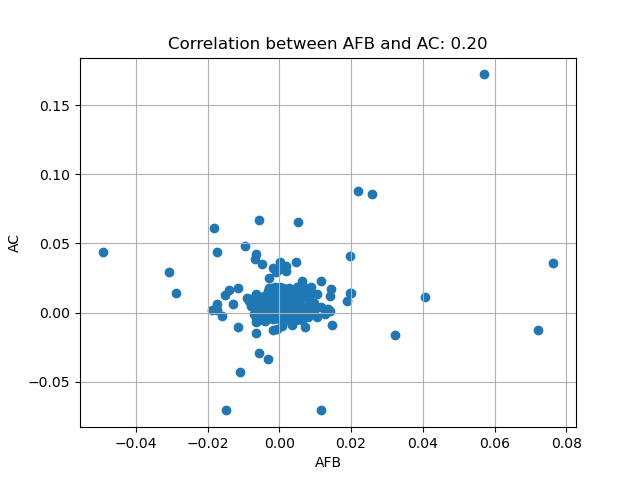 | 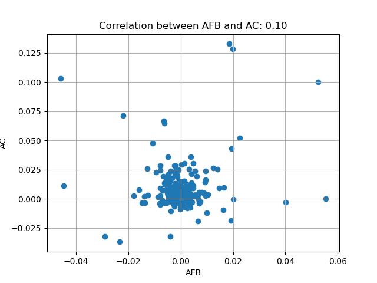 |
|--------------------------------|--------------------------------|
| 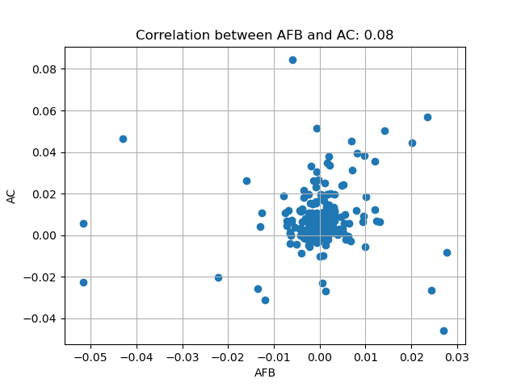 | 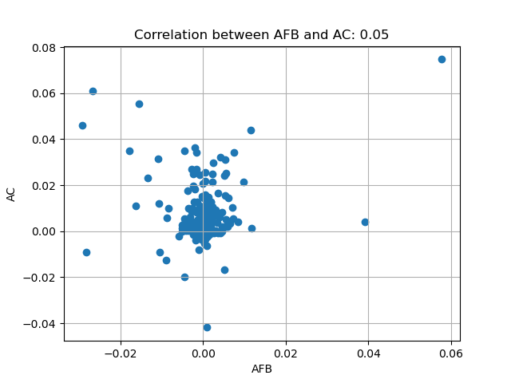 |

### $A_{FB}$ and $A_{out}$

| 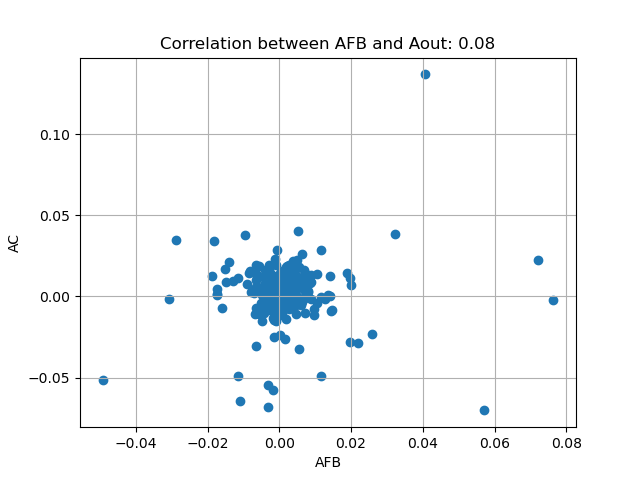 | 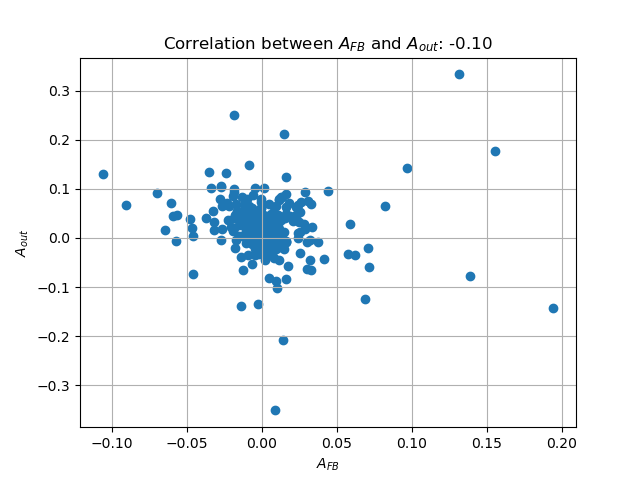 |
|--------------------------------|--------------------------------|
| 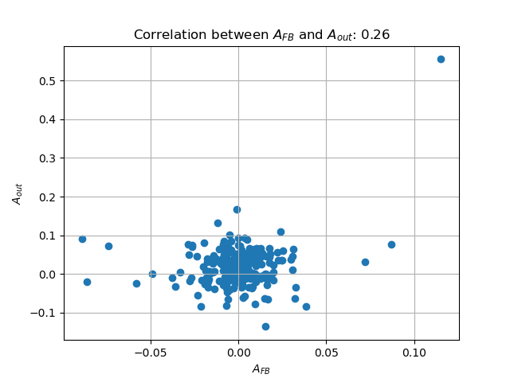 | 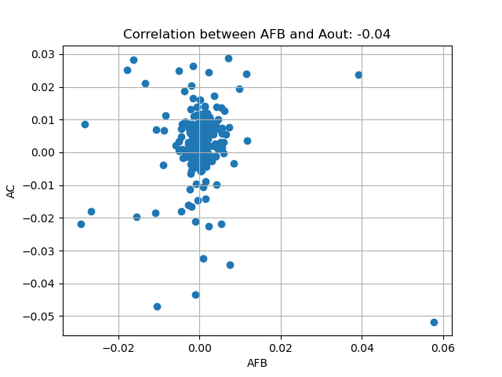 |

### $A_{FB}$ and $A_{in}$

| 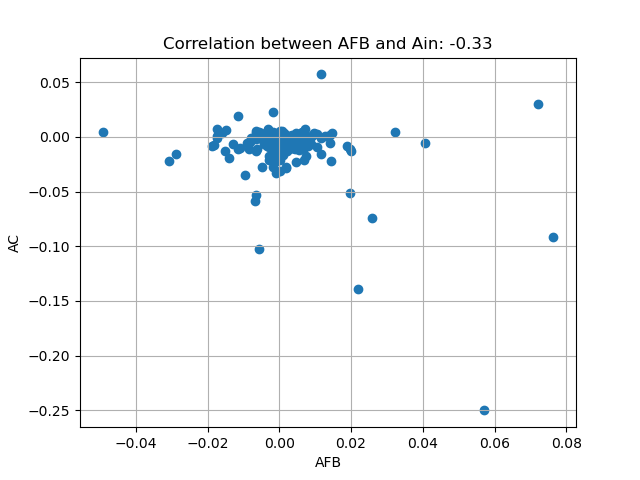 | 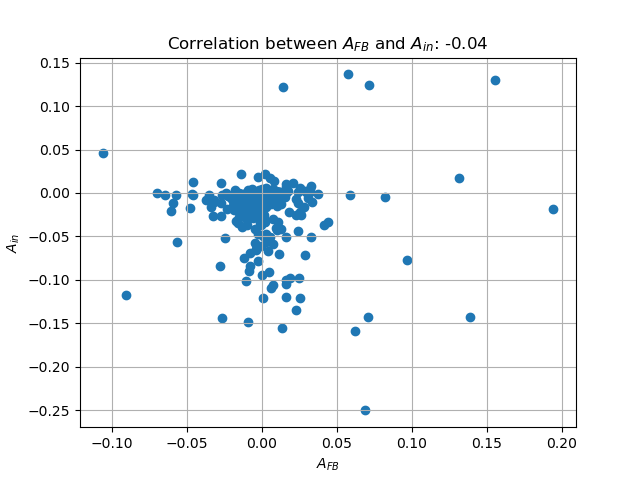 |
|--------------------------------|--------------------------------|
| 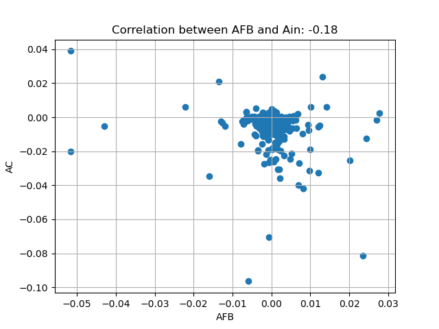 | 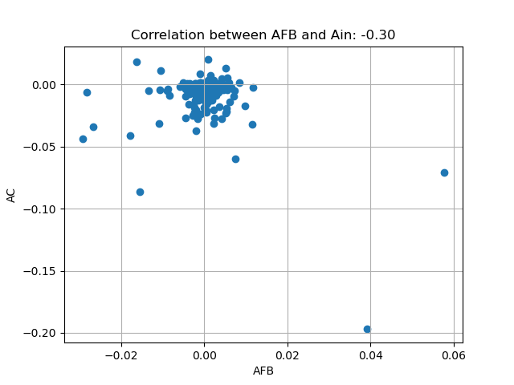 |